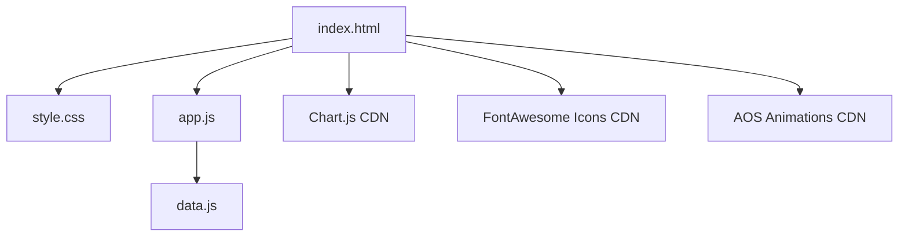

# Implementation Plan - IoT Assistant Training Portfolio Website

We will build a premium, responsive single-page dashboard-style portfolio website for **Supriya**, an IoT Assistant Trainee under the Government of India Skill India Mission at IIIT Kottayam. 

The application will feature a futuristic dark-blue, white, and sky-blue glassmorphism aesthetic, equipped with custom interactive charts, attendance trackers, searchable components, and an expandable 60-day learning journal database.

## User Review Required

> [!IMPORTANT]
> **Aesthetic Approach (Vanilla CSS + Glassmorphism)**
> As per guidelines, we will build custom components using Vanilla CSS to achieve maximum precision over gradients, backdrop-filters, card-hover transitions, and the dark/light mode toggle. This will give a premium, custom-designed feel rather than a generic UI.
>
> **Interactive 60-Day Journal & Lab Data**
> Rather than bloating the HTML with 10,000+ lines of raw markup for the 60-day journal and multiple labs, we will define these in a structured, easy-to-edit JavaScript data module (`journalData.js` and `labData.js`). The page will dynamically render these, providing real-time text searching, category filtering, and collapse/expand controls. This also makes it incredibly easy for the student to update their logs in one clean file.

## Open Questions

None at this time. The requirements are detailed and clear. If you have any specific text or images you want to replace in the future, the code is structured modularly to allow simple text edits.

---

## Proposed Changes

We will create a clean, organized folder structure in the workspace (`d:\internship`):
- `/index.html` - Main structure with semantic HTML, SEO meta tags, and layouts.
- `/css/style.css` - Custom styling: Glassmorphism tokens, CSS variables, Dark/Light themes, animations, layout grids.
- `/js/data.js` - Easy-to-edit database for the 60 Days Journal, Labs, and Projects.
- `/js/app.js` - Chart.js setup, canvas particle background (IoT circuits), attendance calendar logic, dynamic filters, search functionality, collapse/expand handlers.
- `/assets/` - Directory for images, certificates, and logos.

---

### Component Architecture

#### [NEW] [index.html](file:///d:/internship/index.html)
The primary entry point. Contains the complete markup for the single-page dashboard portfolio, structure of the sections (Hero, About, Modules, Journal, Labs, Projects, Skills, Certificates, Attendance & Progress, Contact, Footer). Include containers for dynamic sections.

#### [NEW] [style.css](file:///d:/internship/css/style.css)
The core design system.
* **Colors**: Premium Dark Blue (`#0a192f`), Sky Blue (`#00b4d8`), Soft Cyan (`#90e0ef`), White Glass (`rgba(255, 255, 255, 0.05)`).
* **Glassmorphism**: Sleek `backdrop-filter: blur(12px)` and thin semi-transparent borders for cards and sections.
* **Layouts**: CSS Grid for dashboard modules, Flexbox for timeline and headers.
* **Responsive**: Breakpoints for mobile, tablet, and widescreen viewports.
* **Dark/Light Mode**: CSS Variables toggling between deep space dark and pristine clean light themes.

#### [NEW] [data.js](file:///d:/internship/js/data.js)
Stores the structured content for:
* **Daily Journal**: 60 days of logs (Day 1-60). Day 1 to 5 will have sample IoT theory/lab topics, and Day 6-60 will be auto-generated placeholders that can be easily customized.
* **Labs**: Interactive lists of labs (including components, objectives, circuit placeholders, and sample Arduino code).
* **Projects**: Full project schema (Smart Home, Smart Agriculture, etc.).

#### [NEW] [app.js](file:///d:/internship/js/app.js)
Handles page interactions and visual enhancements:
* **IoT Particle Canvas**: High-performance canvas animation simulating connected nodes and circuit paths in the Hero background.
* **Interactive Timeline**: Render the 60-day journal with search/filter features (e.g. search "Arduino" or "Sensors" across all days).
* **Chart.js Configs**: Beautiful charts displaying weekly progress, skills distribution, and lab assignments.
* **Attendance Calendar**: Render a real-time responsive attendance tracker representing a calendar grid.
* **Dark/Light Theme Toggle**: Handles transitions and stores user preferences.

---

## Verification Plan

### Automated & Manual Verification
1. **Interactive Testing**: Use the browser subagent to render the site, test the Light/Dark mode switcher, filter the Daily Journal, and check details of Lab code modals.
2. **Responsive Verification**: Test layout behavior across mobile widths (375px) and desktop resolutions (1440px).
3. **Animations Check**: Confirm smooth scroll, AOS scroll reveals, and canvas circuit background performance.
4. **Performance**: Verify resource loading of FontAwesome, Chart.js, and custom canvas rendering.
